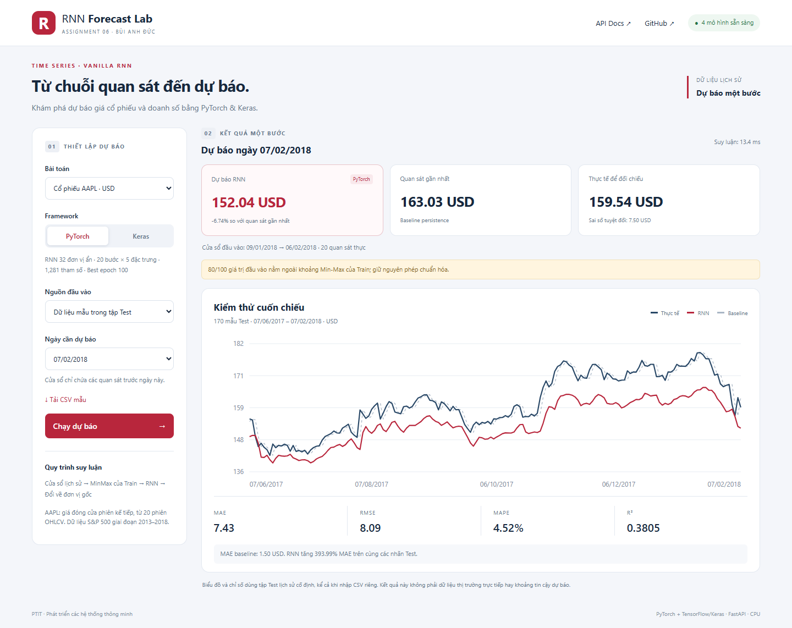

# Assignment 06 — Recurrent Neural Networks

**Học phần:** Phát triển các hệ thống thông minh · PTIT  
**Sinh viên:** Bùi Anh Đức · B23DCCN165 · D23CTPM01  
**Giảng viên:** PGS.TS Trần Đình Quế

Dự án khảo sát Vanilla RNN và thực hiện hai bài toán dự báo một bước: giá đóng cửa cổ phiếu AAPL và doanh số bán lẻ theo ngày. Mỗi bài toán được cài đặt bằng **PyTorch** và **TensorFlow/Keras**, sau đó đóng gói thành API và giao diện web dùng chung.

[Kho GitHub](https://github.com/anhducwszxje/Assignment06) · [Báo cáo LaTeX](technical_report/main.tex) · [Gói nguồn Overleaf](technical_report/Assignment_06_LaTeX_Report.zip)



## 1. Nội dung dự án

| Notebook | Nội dung |
|---|---|
| `00_RNN_Basic_Concepts.ipynb` | Chuỗi và tensor, hàm chuyển trạng thái, ví dụ NumPy, RNN trong hai framework, MSE/MAE, gradient và Jacobian |
| `01_RNN_PyTorch_Stock.ipynb` | Khảo sát AAPL, chuẩn bị chuỗi OHLCV, huấn luyện và đánh giá PyTorch RNN |
| `02_RNN_PyTorch_OnlineRetail.ipynb` | Làm sạch giao dịch, tổng hợp theo ngày, huấn luyện và đánh giá PyTorch RNN |
| `03_RNN_Keras_Stock.ipynb` | Dự báo AAPL bằng Keras SimpleRNN, EarlyStopping và so sánh baseline |
| `04_RNN_Keras_OnlineRetail.ipynb` | Dự báo doanh số bằng Keras SimpleRNN, kiểm tra MAPE và phân tích sai số |

```text
Assignment06/
├── 00_RNN_Basic_Concepts.ipynb
├── 01_RNN_PyTorch_Stock.ipynb
├── 02_RNN_PyTorch_OnlineRetail.ipynb
├── 03_RNN_Keras_Stock.ipynb
├── 04_RNN_Keras_OnlineRetail.ipynb
├── dataset/                  # CSV và dữ liệu gốc đi kèm
├── app/
│   ├── main.py               # FastAPI, các endpoint và startup
│   ├── inference.py          # Nạp mô hình, MinMax, kiểm tra CSV
│   └── static/               # HTML, CSS, JavaScript của giao diện
├── artifacts/
│   ├── stock_pytorch/        # model.pt, scalers.json, metadata.json, reference.npz
│   ├── retail_pytorch/
│   ├── stock_keras/          # model.keras và các tệp tương ứng
│   ├── retail_keras/
│   └── verification.json     # Kết quả kiểm thử HTTP gần nhất
├── samples/                  # Hai CSV lịch sử dùng cho demo
├── scripts/
│   ├── export_models.py      # Chạy notebook trong bộ nhớ và xuất mô hình
│   └── smoke_test.py         # Đối chiếu API với dự báo gốc, kiểm tra lỗi đầu vào
├── technical_report/         # LaTeX, ảnh kết quả, ảnh code và ảnh demo
├── requirements.txt          # Môi trường thực nghiệm notebook
├── requirements-app.txt      # Môi trường ứng dụng
├── requirements-test.txt     # Thêm HTTP client cho kiểm thử
├── .python-version
└── render.yaml               # Cấu hình Web Service cho Render
```

## 2. Dữ liệu và giao thức đánh giá

### AAPL — S&P 500 stock data

- Nguồn: [S&P 500 stock data trên Kaggle](https://www.kaggle.com/datasets/camnugent/sandp500).
- Tệp `dataset/all_stocks_5yr.csv` có 619,040 dòng và 505 mã cổ phiếu. Bài sử dụng 1,259 phiên AAPL từ 08/02/2013 đến 07/02/2018.
- Đầu vào: `open`, `high`, `low`, `close`, `volume`. Cửa sổ: **20 phiên**; mục tiêu: giá `close` của phiên kế tiếp, đơn vị USD.
- Số mẫu sau tạo cửa sổ: **861 Train / 168 Validation / 170 Test**.

### Online Retail II

- Nguồn: [UCI Online Retail II](https://archive.ics.uci.edu/dataset/502/online+retail+ii).
- Dữ liệu gốc có 1,067,371 dòng. Sau loại dòng trùng, hóa đơn hủy và các dòng có số lượng hoặc đơn giá không dương, còn 1,007,913 dòng và 604 ngày có quan sát.
- Đặc trưng ngày: `daily_revenue`, `daily_quantity`, `transaction_count`, `avg_order_value`. Giá trị đơn hàng bình quân bằng doanh số chia số hóa đơn phân biệt.
- Cửa sổ: **14 ngày có dữ liệu**, không nhất thiết là 14 ngày lịch liên tiếp. Mục tiêu là doanh số đơn hàng dương của quan sát kế tiếp, đơn vị GBP; **không phải doanh thu thuần sau hủy/hoàn trả**.
- Số mẫu sau tạo cửa sổ: **408 Train / 76 Validation / 78 Test**.

Cả hai bài toán chia dữ liệu theo thời gian với tỷ lệ khoảng 70% / 15% / 15%. MinMaxScaler chỉ fit trên Train. Cửa sổ được tạo riêng trong từng tập. Dự báo Test là cuốn chiếu một bước, sử dụng các quan sát thực đã xuất hiện trước nhãn cần dự báo. Baseline persistence sử dụng giá trị quan sát gần nhất trên đúng các nhãn Test đó.

## 3. Kết quả thực nghiệm

RNN có một tầng hồi tiếp `tanh` với 32 đơn vị ẩn và một tầng đầu ra tuyến tính. PyTorch chạy 100 epoch và khôi phục trọng số có Validation MSE nhỏ nhất; Keras chạy tối đa 100 epoch với EarlyStopping, patience 15 và khôi phục best weights.

| Dữ liệu | Mô hình | MAE | RMSE | MAPE | R² |
|---|---|---:|---:|---:|---:|
| AAPL (USD) | Persistence | 1.50 | 2.11 | 0.94% | 0.9577 |
| AAPL (USD) | PyTorch RNN | 7.43 | 8.09 | 4.52% | 0.3805 |
| AAPL (USD) | Keras SimpleRNN | 13.68 | 15.11 | 8.27% | -1.1612 |
| Bán lẻ (GBP) | Persistence | 22,192.88 | 30,387.10 | 53.58% | -0.3487 |
| Bán lẻ (GBP) | PyTorch RNN | 15,567.14 | 25,337.08 | 33.83% | 0.0623 |
| Bán lẻ (GBP) | Keras SimpleRNN | 15,954.78 | 25,885.71 | 32.58% | 0.0213 |

Hai RNN chưa vượt baseline trên AAPL. Với bán lẻ, MAE giảm khoảng 29.86% và 28.11% so với baseline, nhưng các đỉnh doanh số vẫn khó dự báo. Ngày 09/12/2011 có một giao dịch lớn và giao dịch hủy tương ứng; quy tắc giữ đơn hàng dương tác động trực tiếp đến giá trị mục tiêu của ngày này.

## 4. Chạy giao diện cục bộ

Môi trường đã kiểm tra: **Python 3.12.14, CPU, Windows**. Các checkpoint được cung cấp trong `artifacts/`, vì vậy không cần huấn luyện lại để mở demo.

```powershell
git clone https://github.com/anhducwszxje/Assignment06.git
cd Assignment06
python -m venv .venv
.\.venv\Scripts\python.exe -m pip install -r requirements-app.txt
.\.venv\Scripts\python.exe -m uvicorn app.main:app --host 127.0.0.1 --port 8006 --workers 1
```

Trên Linux/macOS, dùng `.venv/bin/python` thay cho `.\.venv\Scripts\python.exe`.

- Giao diện: <http://127.0.0.1:8006>
- Tài liệu API: <http://127.0.0.1:8006/docs>
- Health check: <http://127.0.0.1:8006/api/health>

Chờ thông báo `Application startup complete` trước khi mở trang. Server nạp và làm nóng cả bốn mô hình lúc khởi động. Giữ terminal đang chạy trong thời gian sử dụng; nhấn `Ctrl+C` để dừng. Nếu cổng đã được dùng, chọn cổng khác bằng `--port`.

### Thao tác demo

1. Chọn AAPL hoặc Online Retail II và chọn PyTorch/Keras.
2. Chọn một ngày Test. Ứng dụng lấy đúng cửa sổ trước ngày đó và chạy dự báo.
3. Đối chiếu dự báo với quan sát gần nhất và giá trị thực. Nhãn thực không được đưa vào cửa sổ mô hình.
4. Xem biểu đồ Test, MAE, RMSE, MAPE, R² và so sánh baseline.
5. Với dữ liệu riêng, chọn **Tải CSV của bạn**, tải tệp hoặc dán nội dung rồi nhấn **Chạy dự báo**. Ứng dụng dự báo quan sát kế tiếp sau dòng cuối; giá trị thực và sai số chưa có nhãn sẽ không được hiển thị.

Biểu đồ và các chỉ số tổng hợp luôn thuộc tập Test lịch sử cố định; chúng không đánh giá CSV mới. Dữ liệu CSV chỉ được xử lý trong request, không lưu thành tệp trên server.

### Định dạng CSV

Hai tệp mẫu có tại [samples/stock.csv](samples/stock.csv) và [samples/retail.csv](samples/retail.csv). Cột phải đúng thứ tự:

```csv
date,open,high,low,close,volume
```

```csv
date,daily_revenue,daily_quantity,transaction_count,avg_order_value
```

Ngày có dạng `YYYY-MM-DD`, tăng dần và không trùng. Dữ liệu cần ít nhất 20 dòng AAPL hoặc 14 dòng bán lẻ, tối đa 2,000 dòng và 250 KB ở giao diện. Không chấp nhận NaN, vô hạn hoặc giá trị âm. Giá OHLC phải dương và phù hợp High/Low; số hóa đơn là số nguyên dương, AOV phải khớp doanh số chia số hóa đơn. CSV bán lẻ là dữ liệu **đã tổng hợp theo ngày**, không phải tệp giao dịch thô.

Đầu vào vượt cực trị Train được thông báo nhưng vẫn dùng scaler đã lưu, không fit lại và không tự cắt về khoảng [0,1]. Với CSV không có nhãn tương lai, ứng dụng không tự giả định ngày tiếp theo là một ngày lịch hay một phiên giao dịch cụ thể.

## 5. API

| Phương thức | Endpoint | Chức năng |
|---|---|---|
| GET | `/api/health` | Trạng thái và danh sách mô hình đã nạp |
| GET | `/api/catalog` | Metadata mô hình và ngày Test có thể chọn |
| GET | `/api/sample/{dataset}` | Tải CSV mẫu; dataset là `stock` hoặc `retail` |
| POST | `/api/predict` | Dự báo một cửa sổ từ dữ liệu mẫu hoặc CSV |
| GET | `/api/evaluate/{dataset}/{framework}` | Chạy đánh giá trên Test; framework là `pytorch` hoặc `keras` |

Ví dụ request:

```json
{
  "dataset": "stock",
  "framework": "pytorch",
  "target_date": "2018-02-07"
}
```

Với CSV riêng, thay `target_date` bằng `csv_text`. Không gửi cả hai. Response có dự báo, đơn vị, baseline, nhãn thực nếu có, phạm vi cửa sổ, thời gian suy luận và thông báo đầu vào vượt vùng Train. Lỗi dữ liệu trả HTTP 400; lỗi schema trả HTTP 422.

## 6. Chạy notebook, xuất mô hình và kiểm thử

```powershell
.\.venv\Scripts\python.exe -m pip install -r requirements.txt
.\.venv\Scripts\python.exe -m ipykernel install --user --name assignment06 --display-name "Python (Assignment 06)"
```

Mở notebook trong VS Code hoặc Jupyter, chọn kernel vừa tạo và chạy theo thứ tự cell từ đầu. `dataset/` phải có các CSV tương ứng.

Xuất lại mô hình bằng đúng mã notebook, không ghi đè notebook:

```powershell
.\.venv\Scripts\python.exe scripts/export_models.py
# Hoặc chỉ xuất một notebook:
.\.venv\Scripts\python.exe scripts/export_models.py --notebook 01
```

Mỗi gói lưu trọng số, các hệ số MinMax, thứ tự đặc trưng, độ dài cửa sổ, epoch được chọn, phiên bản thư viện, hash notebook và các mảng Test tham chiếu. Khi xuất lại, các gói cùng tên được cập nhật; khởi động lại server để nạp trọng số mới.

Trong một terminal khác, khi server đang chạy:

```powershell
.\.venv\Scripts\python.exe -m pip install -r requirements-test.txt
.\.venv\Scripts\python.exe scripts/smoke_test.py --base-url http://127.0.0.1:8006
```

Bộ kiểm tra đối chiếu tất cả 496 dự báo Test của bốn mô hình, nhãn, baseline, ngày; kiểm tra các cửa sổ đầu/giữa/cuối, chế độ CSV và 12 trường hợp đầu vào lỗi. Lần kiểm tra ngày 30/09/2026 đạt **41 kiểm tra**. Sai khác lớn nhất với dự báo lúc xuất là 0 với PyTorch, khoảng 0.000028 USD với Keras AAPL và 0.027514 GBP với Keras bán lẻ; kiểm tra dùng ngưỡng tuyệt đối 0.05 đơn vị tiền. Sai khác nhỏ xuất hiện khi thay đường suy luận/batch của TensorFlow; chỉ số hiển thị giữ nguyên khi làm tròn hai chữ số.

Chi tiết và thời gian request sau làm nóng được lưu ở [artifacts/verification.json](artifacts/verification.json). Đây là đo cục bộ, không phải benchmark tải đồng thời hoặc kết quả trên Render.

## 7. Chuẩn bị triển khai Render

**Trạng thái:** demo đã chạy và kiểm thử cục bộ. Cấu hình Render đã được chuẩn bị; chưa tạo Web Service hay công bố URL Render trong lần thực hiện này.

Render dùng tệp [render.yaml](render.yaml) với Python runtime, một worker Uvicorn và health check `/api/health`. Theo [hướng dẫn FastAPI của Render](https://render.com/docs/deploy-fastapi), server lắng nghe `0.0.0.0` và cổng `$PORT`.

| Thiết lập | Giá trị |
|---|---|
| Repository | `anhducwszxje/Assignment06` |
| Root Directory | Để trống khi dùng repository Assignment06 độc lập |
| Runtime | Python 3.12.14 |
| Build Command | `pip install -r requirements-app.txt` |
| Start Command | `python -m uvicorn app.main:app --host 0.0.0.0 --port $PORT --workers 1` |
| Health Check | `/api/health` |

1. Đưa `app/`, `artifacts/`, `samples/`, `requirements-app.txt`, `.python-version` và `render.yaml` lên repository. Không bỏ qua checkpoint trong `.gitignore`.
2. Trong Render, tạo **Blueprint** từ repository để dùng YAML, hoặc tạo **Web Service** và nhập các thiết lập trên.
3. Kiểm tra gói tài nguyên trước khi tạo dịch vụ. YAML đặt `plan: standard` — **gói trả phí**, chưa được kích hoạt. Hai framework cùng nạp vào một tiến trình cần được cấp RAM phù hợp; gói miễn phí không được xác nhận đủ bộ nhớ cho ứng dụng này.
4. Chờ build và startup thành công. Mở `/api/health`, thử cả bốn cấu hình và CSV trên URL do Render cấp.
5. Chạy lại `smoke_test.py --base-url <URL_RENDER>` để kiểm tra môi trường Linux. Dependency Linux dùng wheel CPU của PyTorch và TensorFlow. Linux/Render chưa được kiểm chứng trong lần chạy Windows này.

Ứng dụng không cần database hay API key, không tải giá chứng khoán trực tiếp và không huấn luyện khi khởi động. Cấu hình hiện tắt tự động deploy (`autoDeployTrigger: off`). Mỗi worker nạp riêng các mô hình, nên tăng worker sẽ làm tăng bộ nhớ sử dụng.

## 8. Báo cáo

Mã LaTeX tại [technical_report/main.tex](technical_report/main.tex), gồm cơ sở toán học, khảo sát dữ liệu, thiết kế thực nghiệm, ảnh code, phân tích kết quả, demo giao diện và triển khai cục bộ. Chọn **XeLaTeX** khi biên dịch trên Overleaf; giữ `images/` cạnh `main.tex`. Có thể nhập trực tiếp gói ZIP nguồn.

## 9. Giới hạn

- Kết quả thuộc một lần chia thời gian và seed 42; chưa phải đánh giá qua nhiều seed hay nhiều giai đoạn.
- Cả hai RNN AAPL kém baseline trên Test. Hai mô hình bán lẻ giảm MAE nhưng R² vẫn gần 0.
- Mô hình bán lẻ giữ doanh số dương, loại giao dịch hủy; thay định nghĩa doanh thu cần xử lý dữ liệu và huấn luyện lại.
- Dự báo có thể nằm ngoài vùng Train hoặc âm vì tầng đầu ra tuyến tính. Giao diện giữ nguyên giá trị để kiểm tra.
- Demo chưa có xác thực, giới hạn tần suất hay kiểm thử tải đồng thời. Kết quả cục bộ không xác nhận độ sẵn sàng của dịch vụ công khai.
